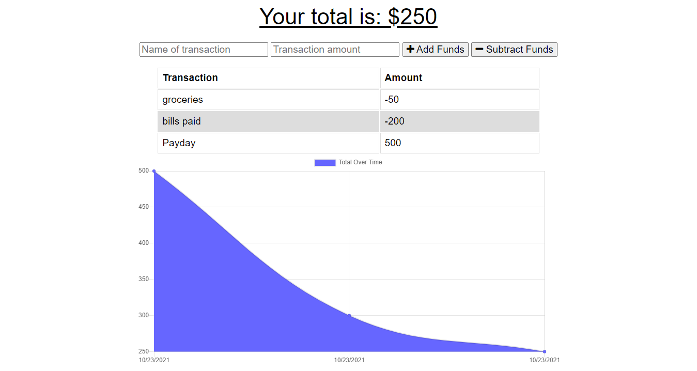

# Budget Tracker 

[Project Repo](https://github.com/kevinjr1998/Budget_Tracker)

[Deployed Application](https://pacific-lowlands-14349.herokuapp.com/)

## Description

This application is a full stack progressive web application that allows a user to track their budget both online and offline. A user can enter both increases and decreases in their budget which will be saved to a database. when offline, if the browser supports `IndexedDB`, then any entries added to the budget are stored in the IndexedDB store. When the user then next connects online, the stored transactions are saved to and external database, and the store is cleared.

## Table Of Contents

  - [Installation](#installation)
  - [Usage](#usage)
  - [License](#license)
  - [Questions](#questions)

## Installation

To install your own version that works locally, first, clone the repo to your local repository. Once you ahve done this, type `npm i` while in the root of the folder to install all dependencies. make sure you have `MongoDB` installed on your device (and optionally `Robo 3T`). Then type `npm start` to run the server, and access the application at `localhost:3000`

To deploy your own version of the application, make sure you have a heroku account and a `MongoAtlas` database set up. Follow [these instrucions](https://devcenter.heroku.com/articles/git), to deploy your application to heroku. Once you have done this, go to your MongoAtlas database and find the option to connect application and copy the connection string. Update the connection string with your unsername, password and database name and go to the heroku page that relates to your application. On the settings tab, find the config vars section and in the `KEY` section, enter `MONGODB_URI` and in the `VALUE` section, enter your updated connection string. This sets up the key-value pair for the connection string. Make sure to run `npm run build` so that your own javascript bundle file is created.

## Usage

## License

This application is covered under the MIT License 

[License Link](https://opensource.org/licenses/MIT)

## Questions

If you have any questions, please contact me at kevinryner@yahoo.co.uk